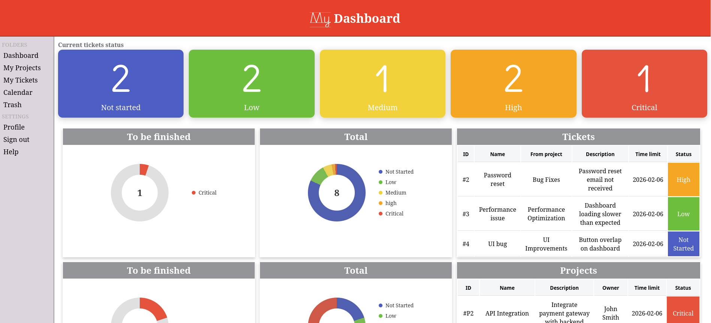
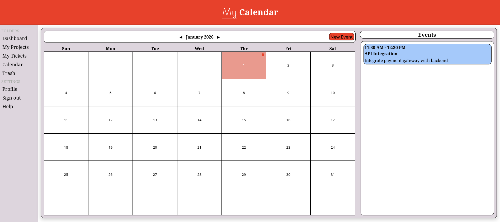

## A Ticketing Web App using Laravel framework and Docker Compose

### Features :
- **Dashboard :** tickets and projects list preview, tickets status, graphics (not finished)
- **Ticket list :** Sorted by Description, Comment, Owner, Duration, Status 
- **Project list :** Sorted by Description, Comment, Owner, Duration, Status 
- **Calendar :** Event viewer and maker
- **Trash :** Where tickets and projects are trashed
- **Profile :** User informations
- **Help :** (Visual only)

## Install

### 1. Make sure to have Docker Compose installed on your machine.
### 2. Inside the project directory
> mkdir -p data/laravel data/redis
### 3. Give specific permissions for the DB
> sudo chown -R www-data:www-data src
### 4. Initialize the data
> docker compose exec app php artisan migrate:fresh --seed

## Disclaimer
### This project was for educationnal purpose only, it's not perfect, it still needs improvements.